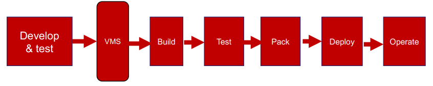
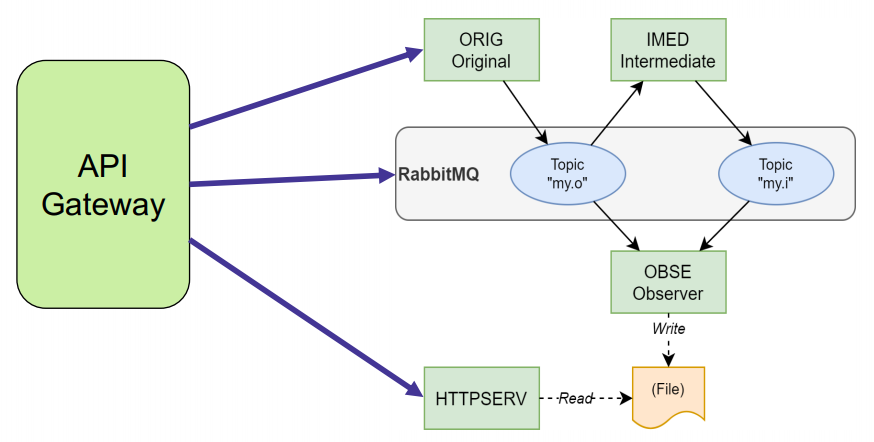
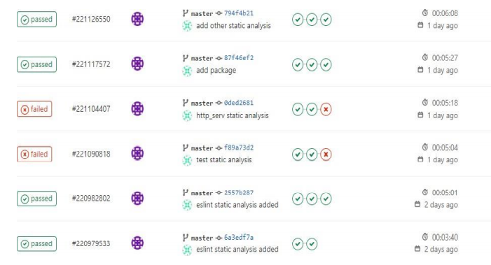
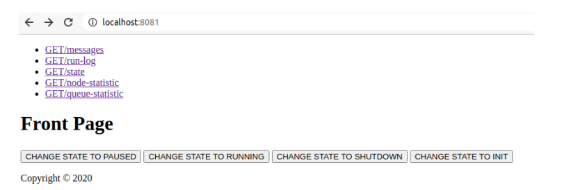

# Introduction
In software engineering, CI/CD or CICD generally refers to the combined practices of continuous integration and either continuous delivery or continuous deployment. CI/CD bridges 
the gaps between development and operation activities and teams by enforcing automation in building, testing and deployment of applications. The system CI pipeline contains four stages. Each stage is assigned to job as described as below 
- build: this job basically builds the application and brings the application live
- test: this job tests the mandatory api gateway using mocha chai and mock api. This job requires installing npm package and running npm test to test the api.
- eslint: this job performs static analysis on the whole application. This job require installing eslint and running npx eslint for each container.
- deploy: finally deploy the system locally.

# Application

The starting point of the application is the message-queue application. The application has total of 5 service namely Service Original, Service Intermediate, Service Observer, Service Main and Finally, Rabbitmq using image. 
- install gitlab and runners on their own machine. A fresh virtual machine is recommended. Instructions to help in this process are below in section gitlab-ci. 
- Define the pipeline using .gitlab-ci.yml for the application you implemented for the message-queue application. The result of the pipeline should be a running system, so the 
containers should be started automatically. (In other words: “git push => the system is up and running)
- Test the pipeline with the current version of the application.
- Implements changes to the system by using the pipeline. The development should be done in test-driven manner.
   - For each new feature, you should first implement tests, then implement the feature
and after passing the tests move to next feature. This behavior should be verifiable 
from in the version history

# Features

Implement an API gateway service that provides the external interface to the system. This service should be exposed from port 8081. The API gateway should provide the following REST-like API.

- GET /messages : Returns all message registered with OBSE-service. 
- PUT /state (payload “INIT”, “PAUSED”, “RUNNING”, “SHUTDOWN”)
  - PAUSED = ORIG service is not sending messages
  - RUNNING = ORIG service sends messages
  - INIT = everything is in the initial state and ORIG starts sending again, state is set to RUNNING
  - SHUTDOWN = all containers are stopped
- GET /state : get the value of state
- GET /run-log : Get information about state changes
    Example output:
    2020-11-01T06:35:01.373Z: INIT
    2020-11-01T06:40:01.373Z: PAUSED
    2020-11-01T06:40:01.373Z: RUNNING
- GET /node-statistic : Return core statistics of the RabbitMQ.
- GET /queue-statistic : Return a JSON array per your queue. For each queue return “message delivery rate”, “messages publishing rate”, “messages delivered recently”, “message published lately”. 

# Results
CI/CD Result

